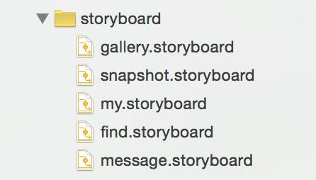
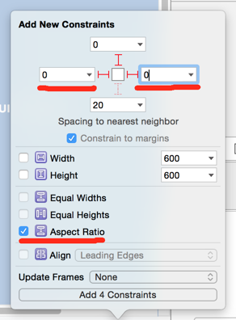

# ios-ui

在Xcode中，storyboard是一个可以让我们对应用界面进行可视化布局的工具，你首先可以在storyboard文件中看到一个或若干个iOS设备屏幕大小的布局区，然后你可以从组件库（Object Library）中拖拽组件到屏幕布局区中进行布局（比如按钮、图片、文本框、labels等），你还可以定义屏幕布局区之间的连接关系。

用Xcode的术语来说，人们可以看到、触碰到或以其他方式（按钮、图片、文本框、labels等）进行交互的用户界面被称为views。屏幕中包含和管理这些views的容器称为view controller。


本文主要会讲storyboard和xib

## storyboard和xib

- storyboard是故事版，强调的是连贯的情景
- xib更多的单一场景，比如不在场景里的viewcontroller或某些视图


storyboard能做xib的所有事情，但是我们还是推荐混用，代码结构上更加清晰，利用每种擅长的点即可

## get  a viewcontroller from storyboard

```
UIStoryboard *storyBoard = [UIStoryboard storyboardWithName:@"gallery" bundle:nil];
UIViewController *home_controller = [storyBoard instantiateInitialViewController];
```

## storyboard不适合团队开发？

- 如果全部功能放到一个storyboard写，肯定不适合，但分拆合理的话，确实是可以团队开发的。
- 扬长避短，比如自定义侧滑、tab等，但对应的vc里是完整路程，这种先手动代码，然后出发流程的地方加载storyboard即可


举个侧滑的REFrostedViewController的例子

```
- (BOOL)application:(UIApplication *)application didFinishLaunchingWithOptions:(NSDictionary *)launchOptions {
    self.window = [[UIWindow alloc] initWithFrame:[[UIScreen mainScreen] bounds]];
    
    UIStoryboard *storyBoard = [UIStoryboard storyboardWithName:@"gallery" bundle:nil];
    UIViewController *home_controller = [storyBoard instantiateInitialViewController];
    
    // Create content and menu controllers
    //
    DEMONavigationController *navigationController = [[DEMONavigationController alloc] initWithRootViewController:home_controller];
    TSMenuViewController *menuController = [[TSMenuViewController alloc] init];
    
    // Create frosted view controller
    //
    REFrostedViewController *frostedViewController = [[REFrostedViewController alloc] initWithContentViewController:navigationController menuViewController:menuController];
    frostedViewController.direction = REFrostedViewControllerDirectionLeft;
    frostedViewController.liveBlurBackgroundStyle = REFrostedViewControllerLiveBackgroundStyleLight;
    frostedViewController.liveBlur = YES;
    frostedViewController.delegate = self;
    
    // Make it a root controller
    //
    self.window.rootViewController = frostedViewController;
    self.window.backgroundColor = [UIColor whiteColor];
    [self.window makeKeyAndVisible];
    
     [[UIApplication sharedApplication] setStatusBarHidden:YES withAnimation:UIStatusBarAnimationFade];
    
    return YES;
}
```

## 拆分流程

但凡是是完整流程的尽量用storyboard做，且每一个流程使用一个storyboard，于是



但是流程又分1个vc或多个vc，此时又会有很多单独的vc，它也是可以storyboard的。

# 布局约束
## 添加布局约束的方式

这里向大家介绍三种在storyboard中添加约束的方式：

### 底部布局约束按钮

这种方式可能是最简单直观的一种方式，在屏幕上选择一个或多个对象，然后点击底部的布局约束按钮添加一个或多个需要的约束。它的好处是可以直观的看到当前选择的对象已经添加了该类中的那些约束。

如果你指选择了一个对象想要添加某个约束，但发现该约束是不可选的，那么就意味着这个约束是适用于两个以上对象的约束。


### 按住Control键拖拽鼠标

你也可以选择一个对象，然后按住Control键和鼠标左键，拖拽鼠标到另一个对象（容器对象，也就是父对象或者选中对象自己），松开鼠标后会弹出适用的约束菜单，你可以选择约束进行添加。

这是我偏爱的一种方式，因为它比上面那种方式来的快多了。


### 菜单/绑定快捷键

你也可以通过菜单选项editor —> pin给一个或多个对象添加布局约束。这是效率最低的一种方式。如果你发现有些约束你会一遍遍的反复添加，那么你就可以给该约束绑定一个快捷键来提高效率。


## 移除布局约束

布局约束可以添加自然也就可以删除。选中某个约束使其高亮显示，然后按下Delete键移除该约束。

如果想移除某个对象上所有的约束，有一个快捷的方式。选择该对象，然后在底部点击Resolve Auto Layout Issues按钮，选择Clear Constaints。


## 布局出现的问题和冲突

我们在添加约束时，经常伴随有警告或者错误出现。虽然有些警告是因为我们还没有添加完约束出现的，当我们添加完我们设想的约束后警告就会自然消失。但大多数的警告还是指明我们的约束确实存在问题，需要我们修复。

查看警告或错误最方便的方式就是在storyboard左侧的结构树中，在view controller的右边会出现一个红色或黄色的小图标，向我们指明这里存在问题：


## 错误摆放view的警告

view位置的错误摆放是一个很常见的警告。当一个view没有摆放在约束规定的位置的时候，会出现该警告。

这些问题会在你切换不同设备的模拟器或鼠标不小心移动了某个对象时出现。

选中一个错误摆放的对象，在屏幕上会出现布局约束给你提示的正确的摆放位置。


点击左侧出现的黄色警告图片，会弹出一个菜单，你可以选择让Xcode改变约束，以适应当前该对象的位置，但通常情况下我们都选择让Xcode将该对象移动到约束规定的位置。

## 缺少布局约束的错误

我们回到早些时候的示例中。这时候我们没有给方块添加Y坐标位置的约束。在运行时没有问题，因为iOS会假设方块的位置就是我们在storyboard中摆放的那个位置。但是Xcode会提示我们一个缺失约束的错误，为了避免意外发生（更换设备尺寸），我还是要根据Xcode的提示添加缺失的约束。

我们给这两个方块添加一个top space to to layout guide约束使方块的位置更加清晰，并消除Xcode的错误提示。


## Size Classes
自适应布局的布局约束自然是好东西，但也不是万能的，有时候我们也需要使用最基本的布局，所以使用size classes将它们两者结合起来才能碰撞出更有激情的火花。

Size Classes并不代表真正的尺寸，而是我们从感官上感觉尺寸的种类，通过这种种类的组合，表示出不同屏幕尺寸设备的横屏及竖屏。

我们在给storyboard中的对象添加约束时可以选择给某一个size class添加约束，所以在你选择特定的size class时，只能看到你添加的只适用于该size class的约束。

这些特性能使我们有效的在不同的设备和屏幕方向中定义、设计不同的用户界面。

## Size Classes中的高和宽

Size Classes为高和宽分别提供了三种类型：紧凑型（compact）、普通型（regular）、任意型（any）。用这三种高和宽的类型就可以组合出9种size class，来表示不同的设备屏幕。

在实际运用中，我们发现并不是所有的尺寸都能在Size Classes中找到明确的组合（比如没有组合可以明确表示iPhone6 Plus的竖屏，iPad的横竖屏也不好区分），但是我们可以使用表示这个尺寸范围的组合。比如我们可以用Compact Width | Regular Height来表示iPhone6 Plus的竖屏。


# 概念

## 页边间距约束（Leading and Trailing space）

- 页边间距约束分前部间距约束（Leading space constaint）
- 尾部间距约束（Trailing space constaint）

## 水平间距约束（Horizontal space constaint）


## 等宽约束（Equal widths constaint）


## 方向比例约束（Aspect ratio constaint）


## FAQ

### storyboard中怎么约束一个空间的长宽比

在控件自身上右键拖拽并松开，连到自己身上，会弹出一个加约束的菜单项，选择Aspect Ratio，然后在右边改成这样就行了


注意firstItem 与secondItem及multipler的设置。例子中设置的长宽比为1：0.6 

### autolayout 如何通过约束设定长宽比



前两个是设置到你视图左右边距为0，就是父视图的宽度，第三个是设置对应的比例


## 原则


### 拆分原则

拆分流程，类似于uml泳道图。在纸上，画业务流程，将可以独立的单一流程，拆成独立的storyboard

### 复用

全局观察ui，将可以复用的提出来
