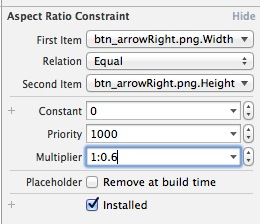

# ios-ui

主要会讲storyboard和xib

## storyboard和xib

- storyboard是故事版，强调的是连贯的情景
- xib更多的单一场景，比如不在场景里的viewcontroller或某些视图

storyboard能做xib的所有事情，但是我们还是推荐混用，代码结构上更加清晰，利用每种擅长的点即可

## FAQ

### storyboard中怎么约束一个空间的长宽比

在控件自身上右键拖拽并松开，连到自己身上，会弹出一个加约束的菜单项，选择Aspect Ratio，然后在右边改成这样就行了

注意firstItem 与secondItem及multipler的设置。例子中设置的长宽比为1：0.6 